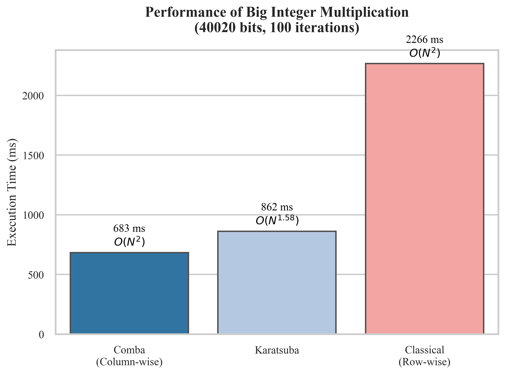
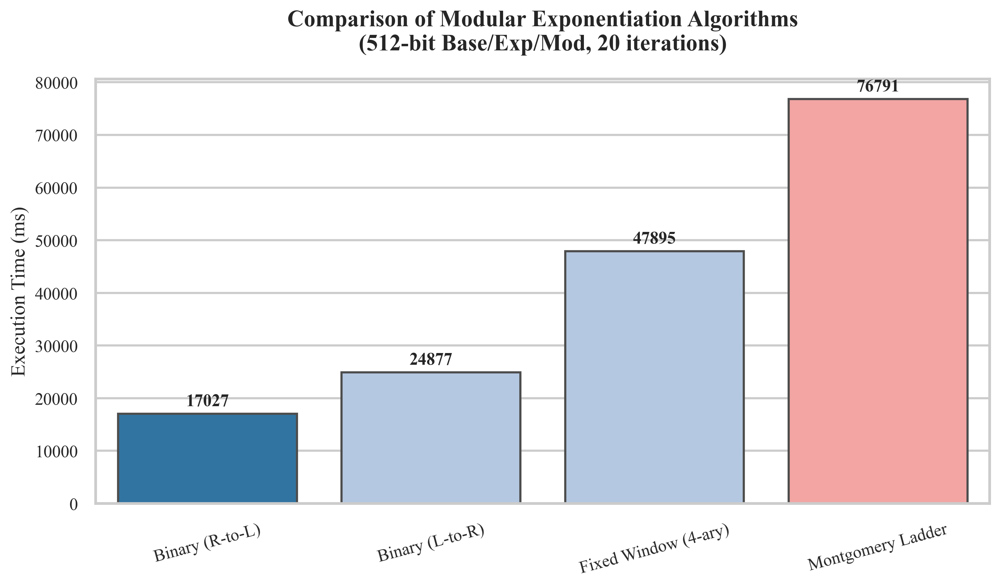
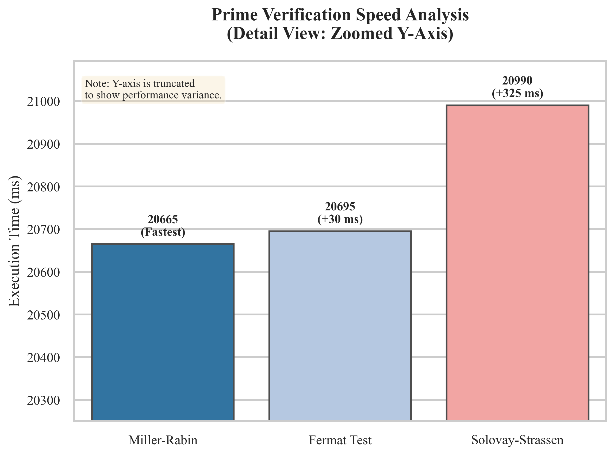

# RSA Cryptographic Algorithms Library


**RSA_Cryptographic** is a comprehensive, educational C++ implementation of the RSA public-key cryptosystem. 

Beyond basic encryption, this project serves as a **performance research platform**. It implements multiple variations of core arithmetic algorithms (Multiplication, Modular Exponentiation, Primality Testing) to analyze their time complexity, efficiency, and security characteristics in real-world scenarios.

---

## 📖 Table of Contents

- [Key Features](#-key-features)
- [Algorithmic Depth](#-algorithmic-depth)
- [Performance Benchmarks](#-performance-benchmarks)
- [Visual Report](#-visual-report)
- [Build & Install](#-build--install)
- [Usage](#-usage)
- [License](#-license)

---

## 🚀 Key Features

*   **Arbitrary Precision Arithmetic**: Custom BigInt implementation handling numbers with thousands of bits.
*   **Modular Arithmetic Kernel**: Optimized for cryptographic operations.
*   **Key Generation**: Robust prime number generation using probabilistic tests.
*   **Security Focused**: Includes constant-time algorithms (Montgomery Ladder) to mitigate side-channel attacks.

---

## 🧠 Algorithmic Depth

This library implements competing algorithms for each stage of RSA to allow for comparative analysis:

### 1. Big Integer Multiplication
*   **Classical (Row-wise)**: The standard schoolbook method ($O(N^2)$). Simple but slow for large inputs.
*   **Comba (Column-wise)**: An optimization of the classical method that minimizes memory writes and carry propagation ($O(N^2)$).
*   **Karatsuba**: A divide-and-conquer algorithm ($O(N^{1.585})$) effective for very large integers.

### 2. Modular Exponentiation
*   **Binary Method (Right-to-Left)**: Efficient standard approach.
*   **Binary Method (Left-to-Right)**: Alternative standard approach.
*   **Fixed Window (k-ary)**: Pre-computes powers to reduce the number of multiplications.
*   **Montgomery Ladder**: A secure, constant-time algorithm designed to resist timing and power analysis attacks.

### 3. Primality Testing
*   **Miller-Rabin**: The industry-standard probabilistic test.
*   **Solovay-Strassen**: Based on the Euler-Jacobi criterion.
*   **Fermat Test**: A basic probabilistic test (used for preliminary filtering).

---

## 📊 Performance Benchmarks

*Data collected on Windows x64 environment.*

### Module 1: Big Integer Multiplication
**Dataset:** 40,020 bits | **Iterations:** 100

| Algorithm | Complexity | Time (ms) | Speedup vs Classical |
| :--- | :--- | :--- | :--- |
| **Comba (Column-wise)** | $O(N^2)$ | **683 ms** | **3.31x** |
| Karatsuba | $O(N^{1.58})$ | 862 ms | 2.62x |
| Classical (Row-wise) | $O(N^2)$ | 2266 ms | 1.00x |

> *Insight: At 40k bits, the lower constant factor of Comba multiplication makes it faster than Karatsuba in this implementation context.*

### Module 2: Modular Exponentiation
**Dataset:** 512-bit Base/Exponent/Modulus | **Iterations:** 20

| Algorithm | Focus | Time (ms) |
| :--- | :--- | :--- |
| **Binary (Right-to-Left)** | Speed | **17,027 ms** |
| Binary (Left-to-Right) | Speed | 24,877 ms |
| Fixed Window (4-ary) | Optimization | 47,895 ms |
| **Montgomery Ladder** | **Security** | 76,791 ms |

> *Insight: The Montgomery Ladder is significantly slower due to redundant calculations required to maintain constant-time execution, a necessary trade-off for security.*

### Module 3: Primality Verification
**Target:** 1024-bit Prime Verification | **Checks:** 100

| Algorithm | Time (ms) | Verdict |
| :--- | :--- | :--- |
| **Miller-Rabin** | **20,665 ms** | Fastest & Standard |
| Fermat Test | 20,695 ms | Comparable |
| Solovay-Strassen | 20,990 ms | Slightly Slower |

---

## 📈 Visual Report

*Visualization of the benchmark data listed above.*

<!-- 
NOTE: Place the images generated by the Python script into an 'assets' folder in your repo.
-->

### 1. Multiplication Performance


### 2. Exponentiation Comparison (Speed vs. Security)


### 3. Prime Verification (Detail View)


---

## 🛠 Build & Install

### Prerequisites
*   C++ Compiler (g++, clang, or MSVC) supporting C++11 or higher.
*   (Optional) CMake.

### Compile via CLI (g++)
```bash
# Compile with optimization flag -O3 for best performance
g++ main.cpp src/*.cpp -o rsa_app -O3 -std=c++17

# Run the benchmark
./rsa_app
```

### Compile via CMake
```bash
mkdir build
cd build
cmake ..
make
./rsa_app
```
